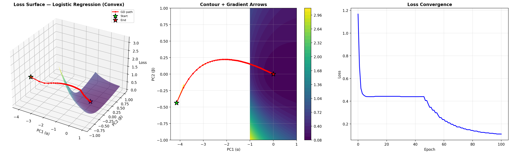
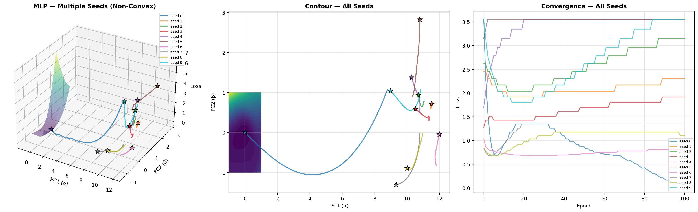
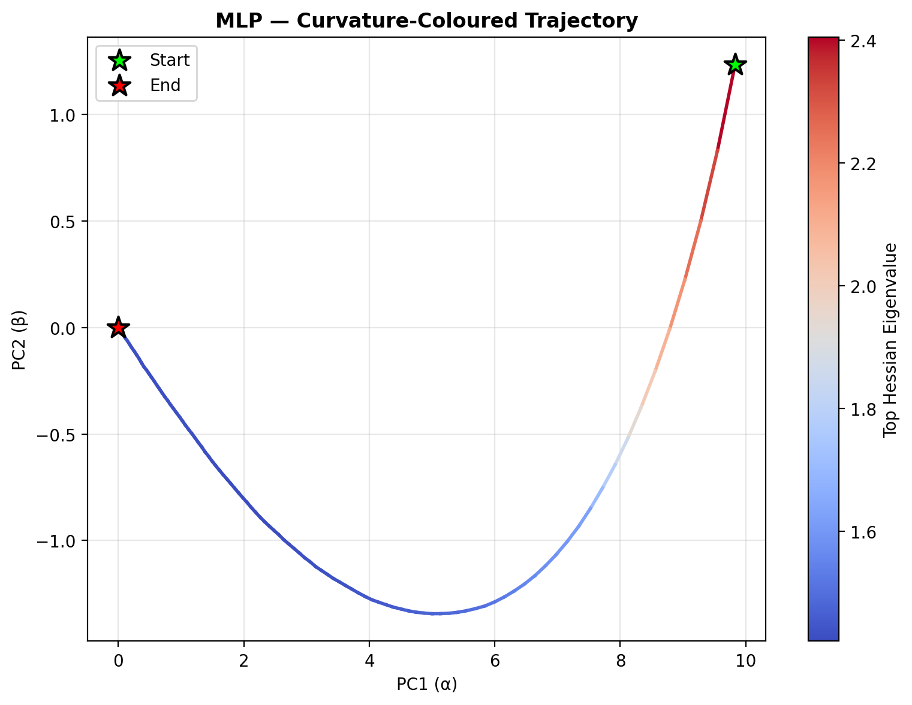
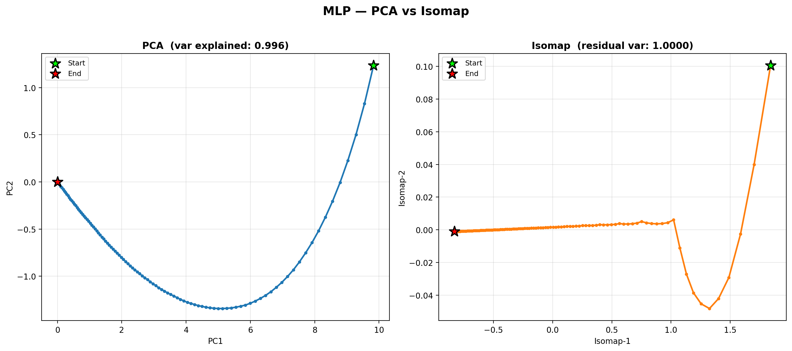
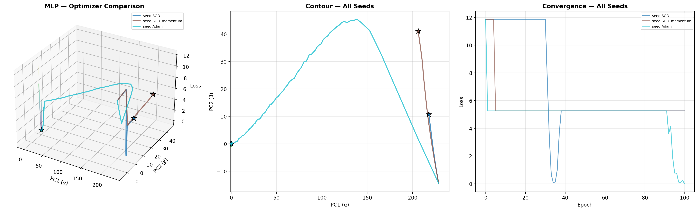

# 🏔️ Gradient Descent Loss Landscape Visualizer

> Visualize how gradient descent navigates loss surfaces — from convex logistic regression to non-convex neural networks — with interactive 3D plots, animated trajectories, and curvature analysis.



## 🎯 What This Project Does

This project provides a complete pipeline to:

1. **Train models** (logistic regression & two-layer MLP) on synthetic data
2. **Collect weight checkpoints** throughout training
3. **Project** the high-dimensional weight trajectory into 2D using PCA (with filter normalization) and Isomap
4. **Reconstruct the loss surface** over the projected plane
5. **Visualize** everything as:
   - 📊 Static 3D surface plots with gradient arrows
   - 🎬 Animated GIFs showing GD step-by-step on a rotating surface
   - 🖱️ Interactive HTML plots (Plotly) — rotate, zoom, hover for epoch & loss info

## 📸 Gallery

### Convex vs Non-Convex
| Logistic Regression (Convex) | MLP (Non-Convex) |
|:---:|:---:|
|  |  |

### Multi-Seed Trajectories — Different Initializations, Different Minima


### Hessian Curvature Along the Path


### PCA vs Isomap Comparison


### Optimizer Comparison (SGD vs Momentum vs Adam)


## 🚀 Quick Start

```bash
# Clone
git clone https://github.com/YOUR_USERNAME/gradient-descent-landscape-viz.git
cd gradient-descent-landscape-viz

# Setup
python3 -m venv .venv
source .venv/bin/activate
pip install -r requirements.txt

# Run everything
python main.py
```

All outputs (PNGs, animated GIFs, interactive HTMLs) are saved to `figures/`.

Open any `.html` file in your browser for interactive 3D exploration — no server needed.

## 📁 Project Structure

```
├── main.py               # End-to-end orchestrator — run this
├── config.py             # All hyperparameters in one place
├── data.py               # Synthetic data generation (make_classification)
├── models.py             # LogisticRegression & MLP (PyTorch)
├── training.py           # Training loop + multi-seed experiments
├── projection.py         # PCA & Isomap dimensionality reduction
├── filter_norm.py        # Per-layer filter normalization (Li et al. 2018)
├── loss_surface.py       # 2D grid loss evaluation
├── gradients.py          # Gradient projection onto PCA plane
├── visualization.py      # Static matplotlib plots
├── animations.py         # Animated GIF generation
├── interactive_plots.py  # Interactive Plotly HTML generation
├── hessian.py            # Hessian eigenvalue analysis (curvature)
├── requirements.txt      # Dependencies
├── what_where.md         # Task-to-code mapping
└── figures/              # All generated outputs
```

## 🔬 Key Concepts

| Concept | Description |
|---------|-------------|
| **PCA Projection** | Projects weight trajectory from ℝᴰ → ℝ² using the top-2 principal components centered at the final optimum θ* |
| **Filter Normalization** | Rescales PCA direction vectors per layer so ‖dₗ‖ = ‖θ*ₗ‖, preventing large layers from dominating (Li et al., 2018) |
| **Loss Surface** | Evaluates L(θ* + αu + βv) over a 2D grid in PCA space |
| **Gradient Arrows** | Full-batch gradients projected onto the PCA plane, showing descent direction |
| **Hessian Curvature** | Top eigenvalue of the Hessian via power iteration — measures surface sharpness |
| **Isomap** | Non-linear dimensionality reduction for comparison with PCA |

## ⚙️ Configuration

All parameters are in [`config.py`](config.py). Key ones:

```python
n_samples = 1000        # dataset size
n_features = 10         # input dimensions
hidden_dim = 32         # MLP hidden layer size
epochs = 100            # training epochs
lr = 0.05               # learning rate
vis_resolution = 50     # loss surface grid resolution
seed_list = [0..9]      # seeds for multi-run experiments
```

## 📚 References

- Li, H., Xu, Z., Taylor, G., Studer, C., & Goldstein, T. (2018). *Visualizing the Loss Landscape of Neural Nets.* NeurIPS.
- Goodfellow, I., Vinyals, O., & Saxe, A. (2015). *Qualitatively characterizing neural network optimization problems.* ICLR.

## 📄 License

MIT

---

*Built as part of the Advanced Machine Learning course at the University of Bremen.*
